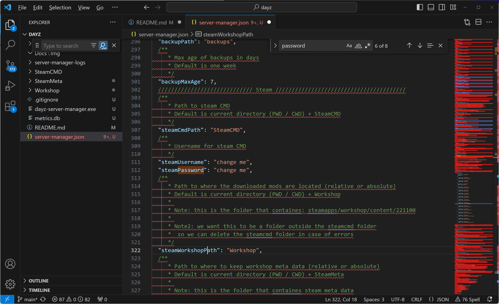
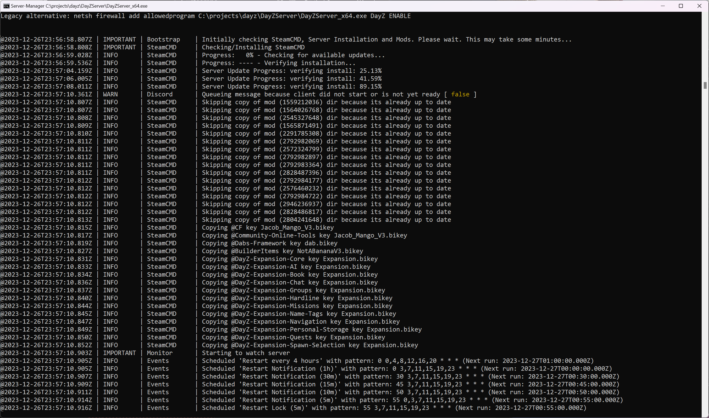
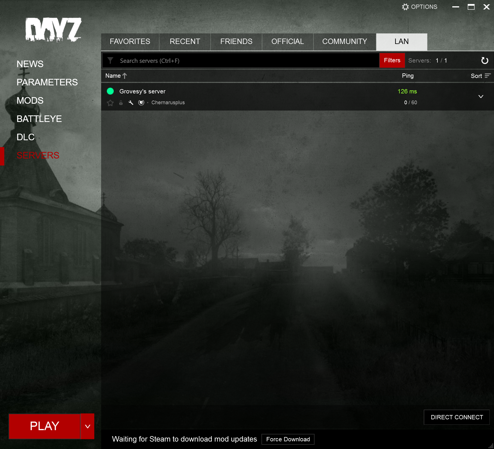

# Dayz Mod development setup 

The aim of this repository is to setup your local dayz development environment, so you can...

- Load and test mods locally before adding to our development server
- Locally develop mods, be that through custom code, or xml configurations for local testing before promoting changes to our development server

## Setup

### Requirements 

You will need the following 

- A Git client for your operating system
- Visual Studio Code or notepad++
  - Download VSCode from [https://code.visualstudio.com/](https://code.visualstudio.com/)
- Ideally two Steam accounts, both with Day-z purchased 
  - One account for running the server
  - A second account for running th game itself 

You don't necessarily need two account, it will just make life much easier - I will document how to run both the client and server on the same account another time

### Preliminary

First we need as git client and download the source 

You can download and install from [https://git-scm.com/download/win](https://git-scm.com/download/win)

Once installed, open a cmd prompt, on your chosen drive ```C:\``` in this case type

```
md projects
cd projects
git clone https://github.com/grovesy/dayz
cd dayz
```

### Configuring the server manager

From the command prompt, make sure you are in ```c:\projects\dayz``` and type 

```
cd\projects\dayz
code ./
``` 

this will open visual studio code, with a file explorer down the left side, open the file 'server-manager.json' and set the stream credentials for your server to operate from



edit these values and then run the application with

```
cd\projects\dayz
dayz-server-manager.exe
```

**You may be asked for a steam guard code:** If so, goto your mail and enter the code directly into the command windows

this will now do the following 

- Download the dayz server executables from stream 
- Download all the mods specified in the server-manager.json file
- Create the dayz server configuration files, 
- Create/copy the key files in 
- Fire up the dayz server with all the correct parameters

You should see a screen like this 



### Connecting to your server

Load dayz via steam with your 'client' account, navigate to 'Servers' and click the LAN tab - you should see

